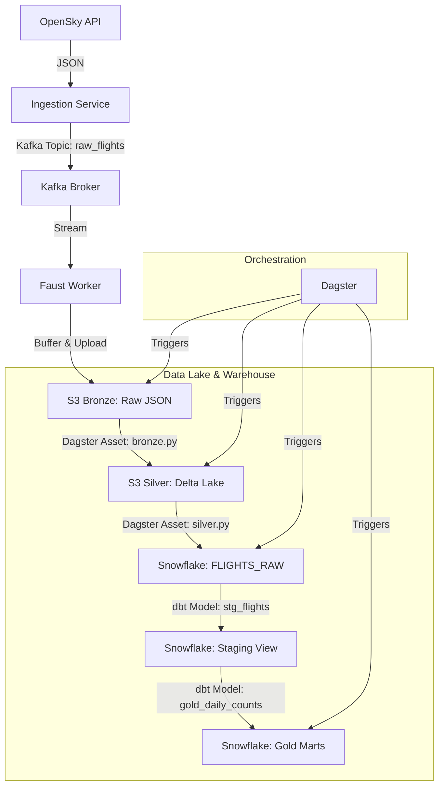

# ✈️ Flight Data Platform Documentation

## 1. Project Overview
This project is an end-to-end real-time flight tracking platform designed to process live data from the OpenSky Network. It demonstrates a robust data engineering architecture capable of handling high-throughput data streams, ensuring fault tolerance, and providing analytical insights through a Medallion Architecture.

### Key Features
- **Real-time Ingestion**: Decoupled ingestion using Kafka to handle API spikes.
- **Stream Processing**: Faust workers for low-latency data buffering and Bronze layer ingestion.
- **Medallion Architecture**: Structured data flow (Bronze -> Silver -> Gold) for data quality and analytics.
- **Modern Stack**: Utilizes Docker, Kafka, Dagster, dbt, Delta Lake, and Snowflake.
- **Infrastructure as Code**: Fully containerized environment using Docker Compose.

---

## 2. Architecture



### Data Flow Layers
1.  **Ingestion Layer**: Fetches data from the external API and pushes it to a message queue (Kafka) to decouple ingestion from processing.
2.  **Streaming Layer (Bronze)**: A Faust worker consumes the Kafka stream, buffers the data, and writes raw JSON files to S3. This preserves the original data fidelity.
3.  **Processing Layer (Silver)**: Batched processing using Dagster reads raw JSON, cleans/deduplicates using Polars, and writes to a Delta Lake table in S3. This ensures ACID transactions and optimized storage.
4.  **Warehousing Layer (Gold)**: Data is loaded from Delta Lake into Snowflake. dbt models then transform this raw data into business-ready aggregates (e.g., daily flight counts, top airlines).

---

## 3. Technology Stack

| Component | Technology | Role | Reason for Choice |
| :--- | :--- | :--- | :--- |
| **Ingestion** | Python, Kafka | Producer & Buffer | Decouples API fetching from processing; handles backpressure during spikes. |
| **Streaming** | Faust | Stream Processing | Python-native stream processing; lightweight and easy to integrate with Kafka. |
| **Storage (Lake)** | AWS S3 | Data Lake | Scalable, durable object storage for Bronze (JSON) and Silver (Delta Lake) layers. |
| **Storage (DW)** | Snowflake | Data Warehouse | Separates compute from storage; enables scalable analytics on large datasets. |
| **Orchestration** | Dagster | Workflow Engine | Asset-based orchestration; provides clear lineage, data awareness, and easy testing. |
| **Transformation** | dbt (Data Build Tool) | SQL Transformation | Industry standard for modular, version-controlled SQL transformations in the warehouse. |
| **Format** | Delta Lake | Table Format | Adds ACID transactions to S3; prevents "dirty reads" and enables time travel. |
| **Containerization** | Docker | Infrastructure | Ensures consistent environments across development and production. |

---

## 4. Component Details

### 4.1. Ingestion Service (`ingestion/`)
-   **`producer.py`**: Connects to the OpenSky Network API.
-   **Behavior**: Polls the API at set intervals, formats the response, and sends messages to the `raw_flights` Kafka topic.

### 4.2. Streaming Worker (`streaming/`)
-   **`worker.py`**: A Faust application.
-   **Logic**:
    -   Subscribes to `raw_flights`.
    -   Buffers incoming flight records in memory (batch size: 10).
    -   Flushes buffer to S3 as Newline Delimited JSON (NDJSON) files in `bronze/raw_flights/YYYY-MM-DD/`.
    -   **Fault Tolerance**: Handles S3 upload failures and ensures data is captured even during high volume.

### 4.3. Orchestration (`orchestration/`)
Dagster manages the batch pipeline defined in `definitions.py`.

-   **Assets**:
    -   **`bronze.py`**: Scans S3 for new raw flight files.
    -   **`silver.py`**:
        -   Reads raw JSON files.
        -   Uses **Polars** for high-performance data cleaning and type casting.
        -   Deduplicates records based on `icao24` and `time_position`.
        -   Writes to S3 as a **Delta Lake** table (`silver/delta_flights`).
    -   **`gold.py`**:
        -   Reads the Silver Delta Table.
        -   Loads data into Snowflake table `FLIGHTS_RAW` using `write_pandas` (optimized bulk loading).
        -   Creates immediate views `DAILY_FLIGHT_COUNTS` and `TOP_AIRLINES`.
    -   **`dbt.py`**: Triggers the dbt project execution.

### 4.4. Transformation (`dbt_project/`)
dbt manages the SQL transformations within Snowflake.

-   **Models**:
    -   **`stg_flights`**: staging view that renames and casts columns from `FLIGHTS_RAW`.
    -   **`gold_daily_counts`**: Mart model that aggregates flight data by date and country, calculating metrics like average velocity and altitude.

---

## 5. Setup & Run

### Prerequisites
-   Docker & Docker Compose
-   Python 3.9+
-   AWS Account (for S3)
-   Snowflake Account

### Configuration
1.  **Environment Variables**: Create a `.env` file in the root directory with the following:
    ```env
    AWS_ACCESS_KEY_ID=your_id
    AWS_SECRET_ACCESS_KEY=your_key
    AWS_REGION=us-east-1
    S3_BUCKET_NAME=your_bucket
    SNOWFLAKE_USER=your_user
    SNOWFLAKE_PASSWORD=your_password
    SNOWFLAKE_ACCOUNT=your_account
    SNOWFLAKE_DATABASE=FLIGHT_DB
    SNOWFLAKE_SCHEMA=PUBLIC
    SNOWFLAKE_WAREHOUSE=COMPUTE_WH
    SNOWFLAKE_ROLE=ACCOUNTADMIN
    ```
2.  **dbt Profile**: Ensure `dbt_project/profiles.yml` is configured to connect to your Snowflake instance.

### Running the Platform
1.  **Start Infrastructure**:
    ```bash
    docker-compose up -d --build
    ```
    This starts Zookeeper, Kafka, Redis, Ingestion, and the Streaming Worker.

2.  **Start Dagster**:
    ```bash
    dagster dev
    ```
    Access the UI at `http://localhost:3000` to trigger the pipeline.

---

## 6. Directory Structure
```
flight-data-platform/
├── dbt_project/              # dbt transformations
│   ├── models/               # SQL models (staging, marts)
│   └── profiles.yml          # dbt connection config
├── ingestion/                # API Producer service
├── orchestration/            # Dagster pipeline
│   ├── assets/               # Python assets (bronze, silver, gold)
│   └── definitions.py        # Pipeline definitions
├── streaming/                # Faust worker
├── docker-compose.yaml       # Infrastructure definition
└── INTERVIEW_PREP.md         # Architectural decisions & narratives
```
